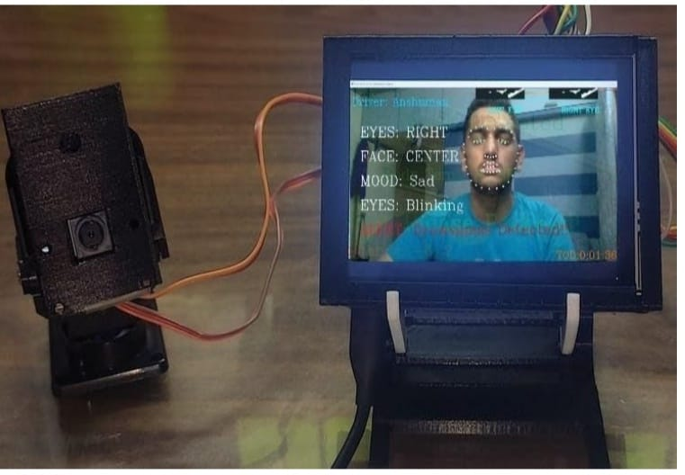
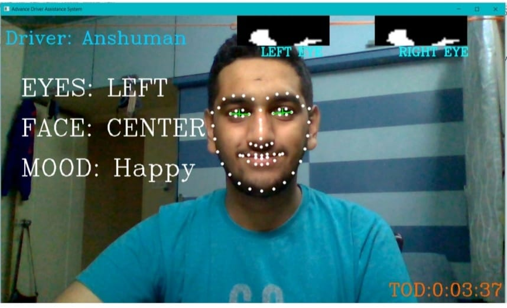
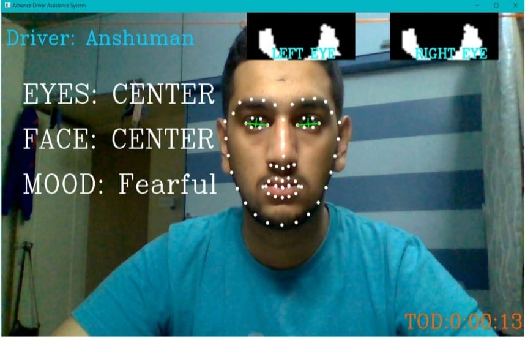
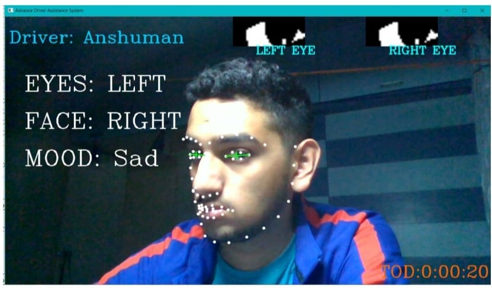
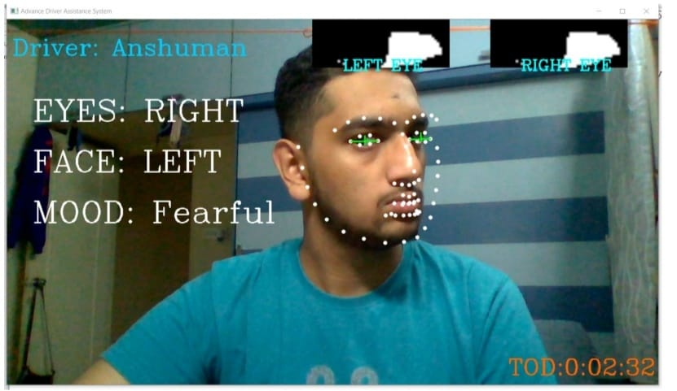
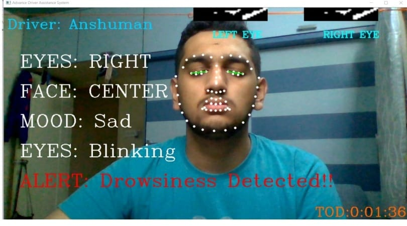
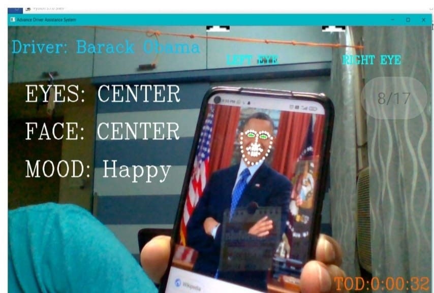
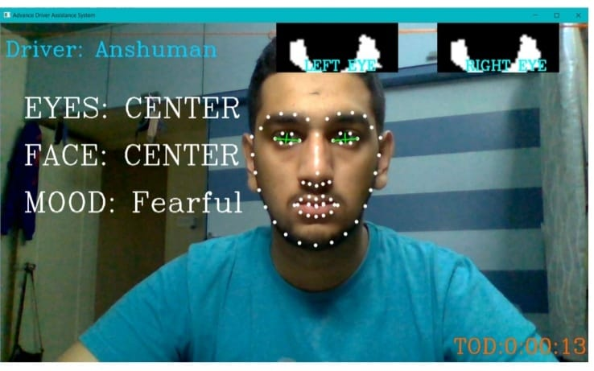

# Advance Driver Assistance and Monitoring System (ADAMS)
### By Team Delta Ducks
 

*A Smart and Adaptive Driver Monitoring and Assistance System based on Facial Landmarking & Deep Learning.*

[Demo Video](https://youtu.be/GD053njx0fU)

### Features

1. Emotion Recognition
2. Facial Recognition
3. Blind Spot Detection
4. Facial Orientation Detection
5. Drowsiness Detection
6. Total Time of Drive Calculation

### Setup

*The Code is primarily designed to run on Raspberry Pi, but can be used on Mac OS or Windows.*

* Download all the Dependencies using the command `pip3 install -r requirements.txt`
* Download the Code or Run the following command to download it `git pull https://github.com/saksham2001/ADAS`

### Running

* Use the following command to the Code `python3 app.py`

### Screenshots

